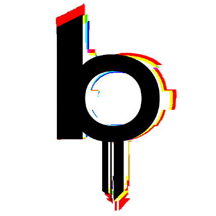

<h1>Wait... how did you end up here?</h1>

  
  
   

<h2>Languages and Tools</h2>

&nbsp;
&nbsp;
&nbsp;
&nbsp;
&nbsp;
&nbsp;
&nbsp;
&nbsp;
&nbsp;
&nbsp; 
&nbsp;
&nbsp;
&nbsp;
&nbsp;
&nbsp;
&nbsp;
&nbsp;
&nbsp;
&nbsp;
&nbsp;

<h2>About Me</h2>

<ul>
  <li>🧙‍♂️ DevSec-Magic-Ops Engineer</li>
  <li>📚 Avid reader always improving my skills</li>
  <li>☁️ Passionate about cloud infrastructure</li>
  <li>🙅‍♂️ Hate dealing with people, but love automating tasks</li>
  <li>🔄 If it can be automated, I'm all in!</li>
</ul>

  

